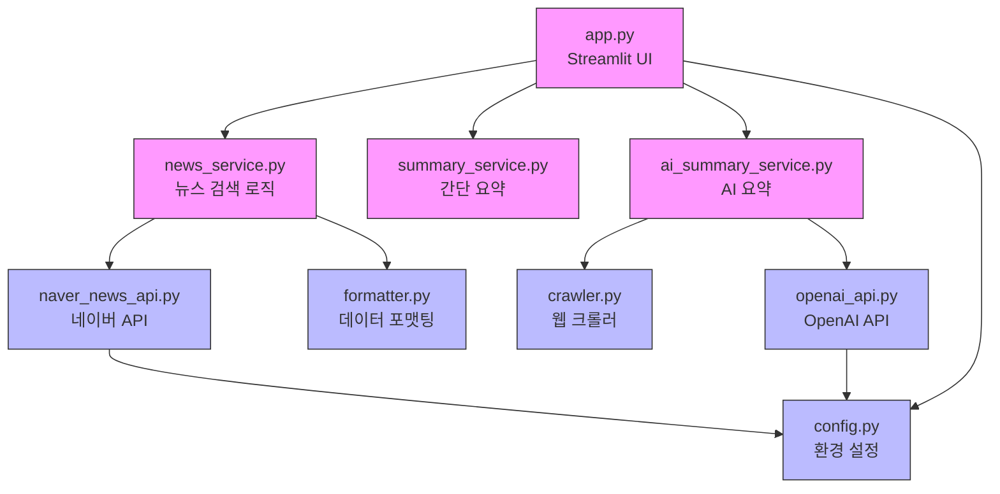

# 의존성 관계

## 📊 전체 의존성 다이어그램



**범례**:
- 🟪 핵심 비즈니스 로직
- 🟦 유틸리티/헬퍼

## 📦 외부 라이브러리

### 프로덕션 의존성

- `streamlit==1.31.0` - 웹 UI 프레임워크
- `requests==2.31.0` - HTTP 요청 라이브러리 (API 호출, 크롤링)
- `python-dotenv==1.0.0` - 환경 변수 관리
- `beautifulsoup4==4.12.3` - HTML 파싱 및 처리 (웹 크롤링)
- `openai==1.12.0` - OpenAI API 클라이언트 (AI 요약)
- `lxml==5.1.0` - XML/HTML 파서 (BeautifulSoup 백엔드)

### 개발 의존성

현재 없음 (향후 테스트 도구 추가 예정)

## 🔗 내부 모듈 의존성 상세

### app.py (Streamlit UI)
**의존하는 모듈**:
- `src.utils.config` - 환경 변수 검증
- `src.services.news_service.NewsService` - 뉴스 검색
- `src.services.summary_service.SummaryService` - 요약 생성

**역할**: 사용자 인터페이스 제공 및 서비스 조립

---

### src/services/news_service.py
**의존하는 모듈**:
- `src.api.naver_news_api.NaverNewsAPI` - API 호출
- `src.utils.formatter` - 데이터 포맷팅

**의존받는 모듈**:
- `app.py`

**역할**: 뉴스 검색 및 데이터 가공 조율

---

### src/services/summary_service.py
**의존하는 모듈**: 없음 (독립적)

**의존받는 모듈**:
- `app.py`

**역할**: 뉴스 요약 및 키워드 추출 (완전히 독립적인 유틸리티)

---

### src/api/naver_news_api.py
**의존하는 모듈**:
- `src.utils.config` - API 인증 정보
- `requests` (외부) - HTTP 요청

**의존받는 모듈**:
- `src.services.news_service`

**역할**: 네이버 API와의 통신 추상화

---

### src/utils/config.py
**의존하는 모듈**:
- `dotenv` (외부) - 환경 변수 로드

**의존받는 모듈**:
- `app.py`
- `src.api.naver_news_api`

**역할**: 전역 설정 제공

---

### src/utils/formatter.py
**의존하는 모듈**:
- `re` (표준 라이브러리) - 정규표현식

**의존받는 모듈**:
- `src.services.news_service`

**역할**: 데이터 정제 및 포맷팅

---

## ⚠️ 의존성 품질 체크

- ✅ **순환 의존성**: 없음
- ✅ **의존성 깊이**: 최대 3단계 (app → service → api/utils) - 적절함
- ✅ **결합도**: 낮음 - 각 모듈이 독립적으로 교체 가능
- ✅ **계층 구조**: 명확한 단방향 의존성 (UI → Service → API/Utils)

## 💡 설계 원칙

### 1. 계층화 아키텍처
```
Presentation Layer (app.py)
         ↓
Business Logic Layer (services/)
         ↓
Data Access Layer (api/)
         ↓
Utilities (utils/)
```

### 2. 의존성 역전 원칙
- 상위 계층이 하위 계층에 의존
- 하위 계층은 상위 계층을 알지 못함
- 각 계층을 독립적으로 테스트 가능

### 3. 단일 방향 흐름
- 의존성이 한 방향으로만 흐름 (순환 없음)
- 명확한 책임 분리
- 쉬운 유지보수 및 확장

## 🔧 향후 확장 시 고려사항

웹 애플리케이션 전환 시:
- `app.py` → `backend/app.js` (Express) + `frontend/` (React/Vue)
- 기존 `services/`, `api/`, `utils/` 모듈은 그대로 재사용 가능
- API 계층만 RESTful 엔드포인트로 노출
